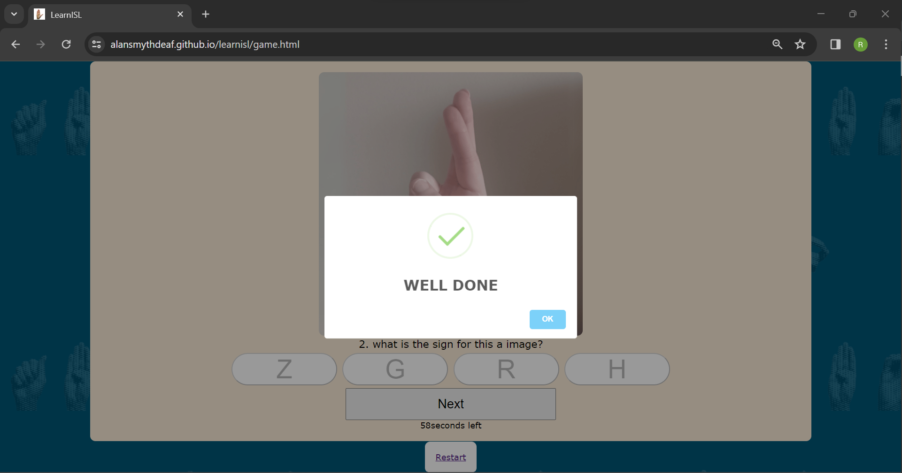

# [LEARNISL](https://alansmythdeaf.github.io/learnisl)

Learning Irish Sign Language

The website is a quiz online learning ten different alphabet.

## UX

When I decied to an online quiz, had many different options but decided to go with learn Irish Sign Langaguge(ISL), this is a basic quiz just to learn ISL.

### Colour Scheme

The main color in the back that I decided to use is

- `#005677` used for background colour of all the pages.
- `#FAEBD7` used for inside quiz game page.
- `#FFFFFF` used for primary text.
- `#000000` used for for buttons and for how to play page.

The reason I chose blue is that, it represent the Deaf Community and I ensure that black text has white background so that it's viviewing accessibility.

### Typography

I use the font Verdana as it's it score highly for web accessibility, I kept that one font throughout the website

## User Stories

### New Site Users

- As a new site user, I would like to easily understand where to go and how to play the quiz.
- As a new site user, I would like to easily play the quiz.

### Returning Site Users

- As a returning site user, I would like to do the quiz easily over and over again and hopefully get 10 out of 10.

## Wireframes

Balsamiq was used to create a layout of the website in the planning idea for the website. I had create a wireframe for each page in mobile, tablet and desktop.

### Mobile Wireframes

| Index | Game | How to play |
| ------------- | ------------- | ------------- |
|  |   |  |

### Tablet Wireframes

| Index | Game | How to play |
| ------------- | ------------- | ------------- |
|  |   |  |

### Desktop Wireframes

| Index | Game | How to play |
| ------------- | ------------- | ------------- |
|  |   |  |

## Features

The quiz website has three pages, Index/Home page, Game page, How to play page.

The website is an online quiz, the questions are images and have four answer, when you chose an correct answer the sweet alert will pop up and say well done and an wrong answer pop will be hard luck. At the end of the quiz you will get a score result i.e You scored 3 our of 10! with time countdown left.

The quiz has a timer count down, if you failed to complete the quiz before the countdown you will get an alert saying game over and it will bring you back to home page
### Existing Features

| **Image for ISL** | **Title for feature #2**|
| ------------- | ------------- |
|  |   | 
| - This feature is an image that is use for the questions, without using the images as question the quiz wouldnt use at all | - The feature of this is that giving an pop up alert is telling user that they are either correct or wrong, which I think it's useful|

### Future Features

- More Questions
    - I would include 26 alphabet and increase the number of questions
- Options
    - I would include different options to learn ISL - basic words &  numbers & alphabet & Sentence
- Video
    - Would add a video as a question, Person signing sentence and try to figure out what the person said

## Tools & Technologies Used

- [HTML](https://en.wikipedia.org/wiki/HTML) used for the main site content.
- [CSS](https://en.wikipedia.org/wiki/CSS) used for the main site design and layout.
- [JavaScript](https://www.javascript.com) used for user interaction on the site.
- [Python](https://www.python.org) used as the back-end programming language.
- [Dev Tools](https://developer.chrome.com/docs/devtools) used for see different responsive pages, also edit pages and diagnose problems
- [W3C](https://validator.w3.org/) used for validating the website coding
- [Balsamiq](https://balsamiq.com) used for drawing a pre-website wireframes
- [Git](https://git-scm.com) used for version control. (`git add`, `git commit`, `git push`)
- [GitHub](https://github.com) used for secure online code storage.
- [GitHub Pages](https://pages.github.com) used for hosting the deployed front-end site.
- [Gitpod](https://gitpod.io) used as a cloud-based IDE for development.
- [Coolors](https://coolors.co/) used for displaying colours in the website
- [Canva](https://www.canva.com/) used for designing the images in the roll of honour page
- [google](https://www.google.com/) used for searching information
- [Youtube](https://www.youtube.com/) used for searching tips
- [Slack](https://slack.com/intl/en-ie/) used for looking at tips from others students projects
- [co-pilot](https://copilot.microsoft.com/) used for writing english

## Testing

For all testing, please refer to the [testing.md](testing.md) file.

## Deployment

The site was deployed to GitHub Pages. The steps to deploy are as follows:

- In the [GitHub repository](https://github.com/AlanSmythDeaf/learnisl), navigate to the Settings tab 
- From the source section drop-down menu, select the **Main** Branch, then click "Save".
- The page will be automatically refreshed with a detailed ribbon display to indicate the successful deployment.

The live link can be found [here](https://alansmythdeaf.github.io/learnisl)

### Local Deployment

This project can be cloned or forked in order to make a local copy on your own system.

#### Cloning

You can clone the repository by following these steps:

1. Go to the [GitHub repository](https://github.com/AlanSmythDeaf/learnisl) 
2. Locate the Code button above the list of files and click it 
3. Select if you prefer to clone using HTTPS, SSH, or GitHub CLI and click the copy button to copy the URL to your clipboard
4. Open Git Bash or Terminal
5. Change the current working directory to the one where you want the cloned directory
6. In your IDE Terminal, type the following command to clone my repository:
	- `git clone https://github.com/AlanSmythDeaf/learnisl.git`
7. Press Enter to create your local clone.

Alternatively, if using Gitpod, you can click below to create your own workspace using this repository.

Please note that in order to directly open the project in Gitpod, you need to have the browser extension installed.
A tutorial on how to do that can be found [here](https://www.gitpod.io/docs/configure/user-settings/browser-extension).

#### Forking

By forking the GitHub Repository, we make a copy of the original repository on our GitHub account to view and/or make changes without affecting the original owner's repository.
You can fork this repository by using the following steps:

1. Log in to GitHub and locate the [GitHub Repository](https://github.com/AlanSmythDeaf/learnisl)
2. At the top of the Repository (not top of page) just above the "Settings" Button on the menu, locate the "Fork" Button.
3. Once clicked, you should now have a copy of the original repository in your own GitHub account!

### Local VS Deployment

There is no difference from local and deployment as you can see the examples below, the different in the game is the images as it's the shuffle questions

| Index | Game |
| --- | --- |
|  |  |.

## Credits

### Content

| Source | Location | Notes |
| --- | --- | --- |
| [Markdown Builder](https://tim.2bn.dev/markdown-builder) | README and TESTING | tool to help generate the Markdown files |
| [Youtube](https://www.youtube.com/watch?v=riDzcEQbX6k) | Game Page | "Build a Quiz App with JavaScript" |
| [Youtube](https://www.youtube.com/watch?v=PBcqGxrr9g8) | Game Page | "Make a Quiz App with JavaScript" |
| [Sweet Alert](https://sweetalert2.github.io/) | Game Page | interactive pop-up |
| [Co-pilot](https://copilot.microsoft.com/) | How to play | Choice for text on for how to play |

### Media

| Source | Location | Type | Notes |
| --- | --- | --- | --- |
| [canva](https://www.canva.com) | entire page | image | background image on all page |
| [canva](https://www.canva.com) | game | image | tool for compression |
| [image](https://alansmythdeaf.github.io/learnisl/game.html) | game page | image | The ISL images are my own |

### Acknowledgements

- I would like to thank my Code Institute mentor, [Tim Nelson](https://github.com/TravelTimN) for his support and guidance throughout the development of this project.
- I would like to thank the [Code Institute](https://codeinstitute.net) tutor team weekly meeting for their support.
- I would like to thank the Deaf people in our group [Code Institute Slack community](https://code-institute-room.slack.com) for the moral support; knowing that all are in the same boat even though we all have difference background.
- I would like to thank my work space, for supporting me in my hours to be flexible
