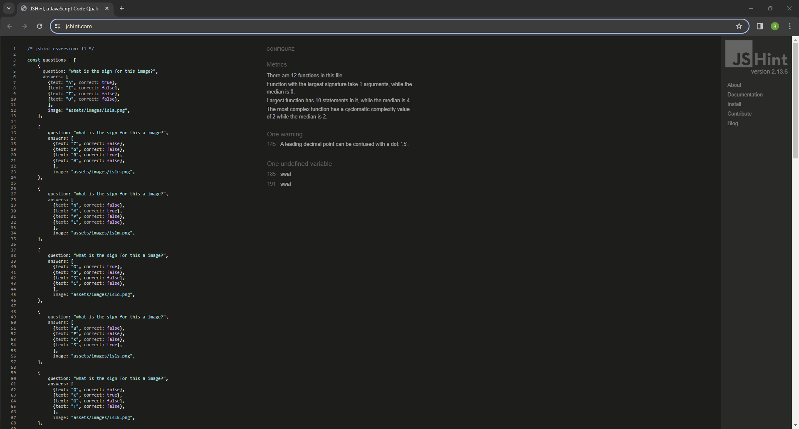
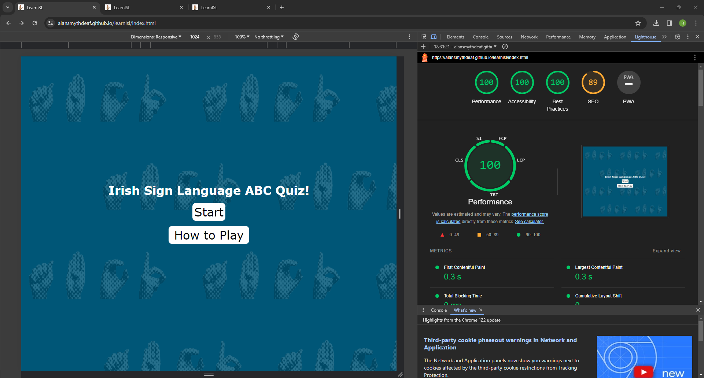
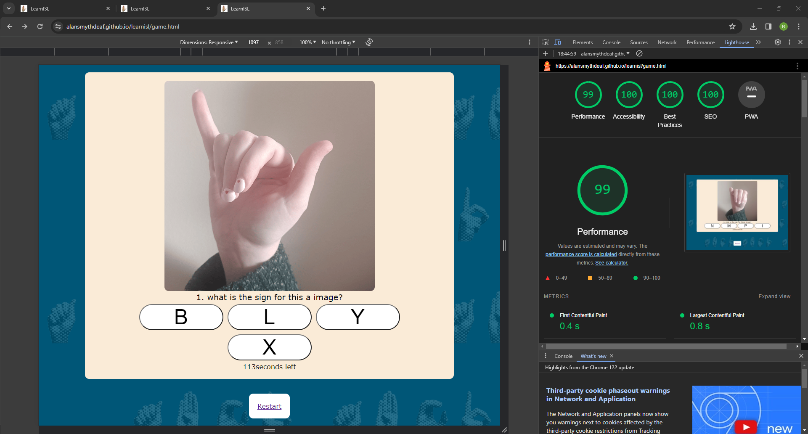
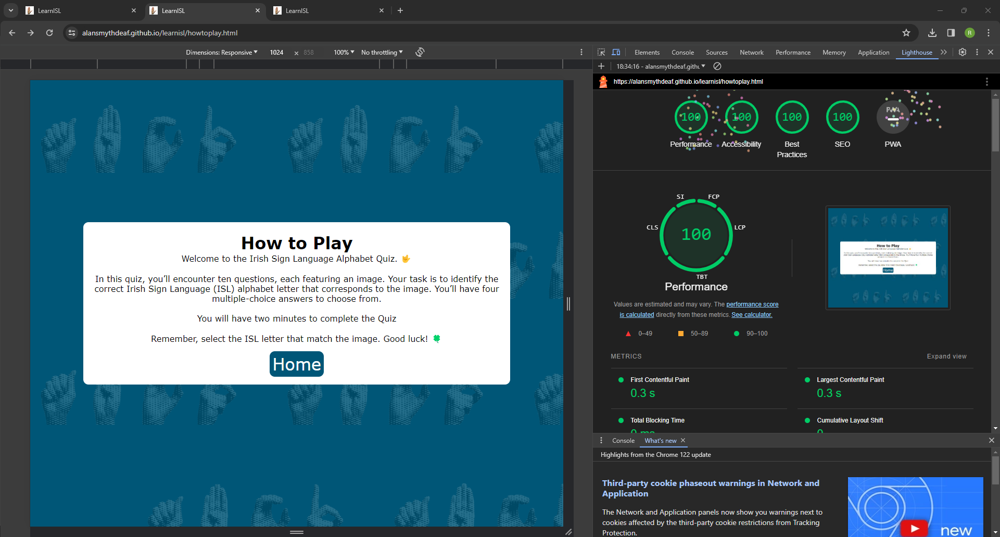
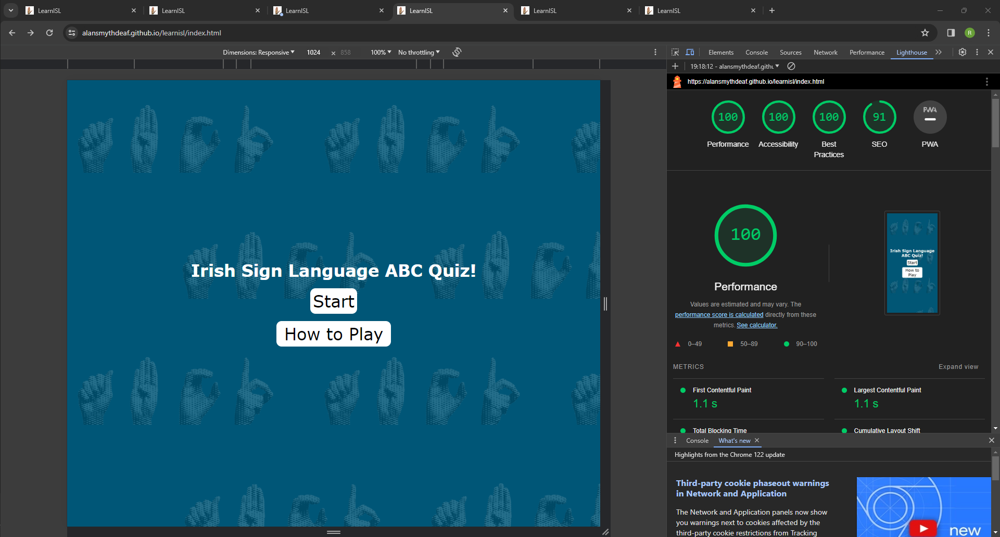
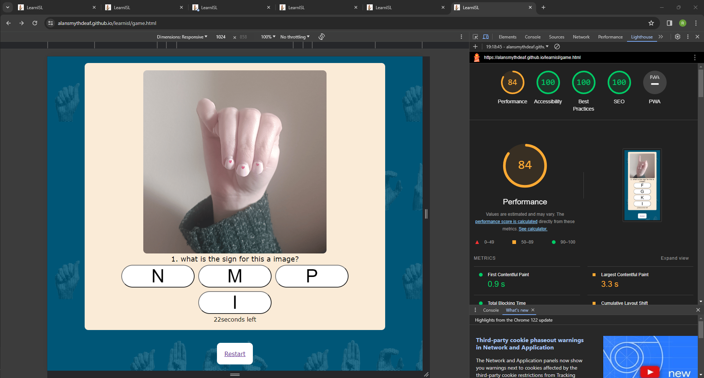
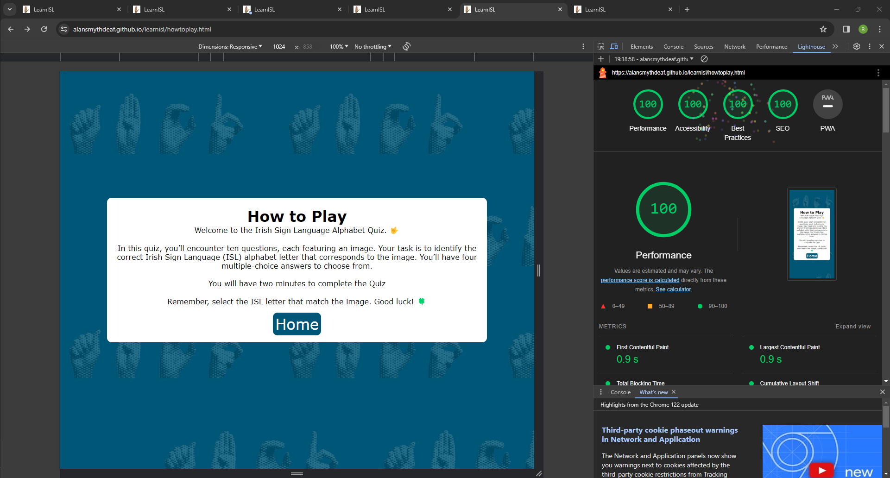
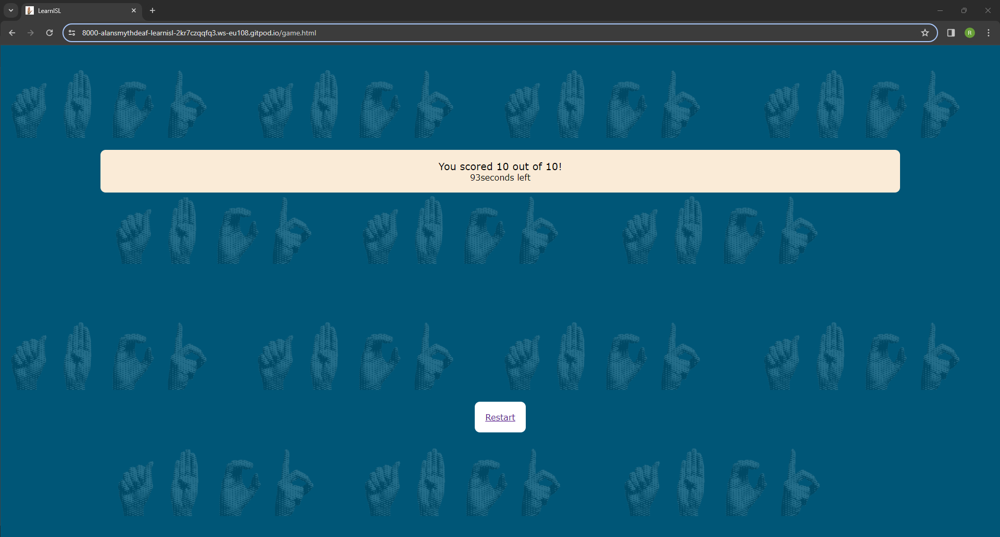

# Testing

Return back to the [README.md](README.md) file.

In this section, is the testing page, I believe I did my best that I have tested each pages.

## Code Validation

### HTML

I have used the recommended [HTML W3C Validator](https://validator.w3.org) to validate all of my HTML files.

| Page | W3C URL | Screenshot | Notes |
| --- | --- | --- | --- |
| Home | [W3C](https://validator.w3.org/nu/?doc=https%3A%2F%2FAlanSmythDeaf.github.io%2Flearnisl%2Findex.html) |  | Document checking completed. No errors or warnings to show. |
| Game | [W3C](https://validator.w3.org/nu/?doc=https%3A%2F%2Falansmythdeaf.github.io%2Flearnisl%2Fgame.html) |  | Document checking completed. No errors or warnings to show. |
| howtoplay | [W3C](https://validator.w3.org/nu/?doc=https%3A%2F%2Falansmythdeaf.github.io%2Flearnisl%2Fhowtoplay.html) |  | Document checking completed. No errors or warnings to show. |

### CSS

I have used the recommended [CSS Jigsaw Validator](https://jigsaw.w3.org/css-validator) to validate all of my CSS files.

| File | Jigsaw URL | Screenshot | Notes |
| --- | --- | --- | --- |
| style.css | [Jigsaw](https://jigsaw.w3.org/css-validator/validator?uri=https%3A%2F%2FAlanSmythDeaf.github.io%2Flearnisl) |  | No Errors |

### JavaScript
I have used the recommended [JShint Validator](https://jshint.com) to validate all of my JS files.

| File | Screenshot | Notes |
| --- | --- | --- |
| script.js |  | One warning 145 A leading decimal point can be confused with a dot: '.5'. - One undefined variable 185 swal & 191 swal. |

## Browser Compatibility

I've tested my deployed project on multiple browsers to check for compatibility issues.

| Browser | Home/index | Game | How to play | Notes |
| --- | --- | --- | --- | --- |
| Chrome |  |  |  | Works as expected |
| Firefox |  |  |  | Works as expected |
| Edge |  |  |  |  Works as expected |

## Responsiveness
I've tested my deployed project on multiple devices to check for responsiveness issues.

- Mobile Phone

| Index/Home | Game  | How to play |
| --- | --- | --- |
|  |  |  | 

- Tablet (Ipad Mini)

| Index/Home | Game  | How to play |
| --- | --- | --- |
|  |  |  | 

- Laptop / Desktop

| Index/Home | Game  | How to play |
| --- | --- | --- |
|  |  |  | 

## Lighthouse Audit

I've tested my deployed project using the Lighthouse Audit tool to check for any major issues.

- Desktop

| Page | Screenshot | Notes |
| --- | --- | --- |
| Home / Index |  | Serve images in nextgen formats - Serve static assets with an efficient cache policy - Links do not have descriptive text |
| Game|  | Serve images in nextgen formats - Serve static assets with an efficient cache policy - Image elements do not have explicit width and height|
| How to play |  | Serve images in nextgen formats - Serve static assets with an efficient cache policy |

- Mobile

| Page | Screenshot | Notes |
| --- | --- | --- |
| Home / Index |  | Serve images in nextgen formats - Serve static assets with an efficient cache policy |
| Game |  | Serve images in nextgen formats - Avoid large layout shifts - Largest Contentful Paint element - Image elements do not have explicit width and height - Serve static assets with an efficient cache policy |
| /how to playGallery |  | Serve images in nextgen formats - Serve static assets with an efficient cache policy |

## User Story Testing

| User Story | Screenshot |
| --- | --- |
| As a new site user, I would like to understand where to go, so that I can either play the quiz or learn how to play the game. |  |
| As a new site user, I would like to be able to play the quiz easily. |  |
| - As a returning site user, I would like to do the quiz easily over and over again and hopefully get 10 out of 10.. |  |

## Bugs

🛑🛑🛑🛑🛑 START OF NOTES (to be deleted) 🛑🛑🛑🛑🛑

This section is primarily used for JavaScript and Python applications,
but feel free to use this section to document any HTML/CSS bugs you might run into.

It's very important to document any bugs you've discovered while developing the project.
Make sure to include any necessary steps you've implemented to fix the bug(s) as well.

**PRO TIP**: screenshots of bugs are extremely helpful, and go a long way!

🛑🛑🛑🛑🛑 END OF NOTES (to be deleted) 🛑🛑🛑🛑🛑

- JS Uncaught ReferenceError: `foobar` is undefined/not defined

    

    - To fix this, I _____________________.

- JS `'let'` or `'const'` or `'template literal syntax'` or `'arrow function syntax (=>)'` is available in ES6 (use `'esversion: 11'`) or Mozilla JS extensions (use moz).

    

    - To fix this, I _____________________.

## Unfixed Bugs

🛑🛑🛑🛑🛑 START OF NOTES (to be deleted) 🛑🛑🛑🛑🛑

You will need to mention unfixed bugs and why they were not fixed.
This section should include shortcomings of the frameworks or technologies used.
Although time can be a big variable to consider, paucity of time and difficulty understanding
implementation is not a valid reason to leave bugs unfixed.

If you've identified any unfixed bugs, no matter how small, be sure to list them here.
It's better to be honest and list them, because if it's not documented and an assessor finds the issue,
they need to know whether or not you're aware of them as well, and why you've not corrected/fixed them.

There are no remaining bugs that I am aware of.
