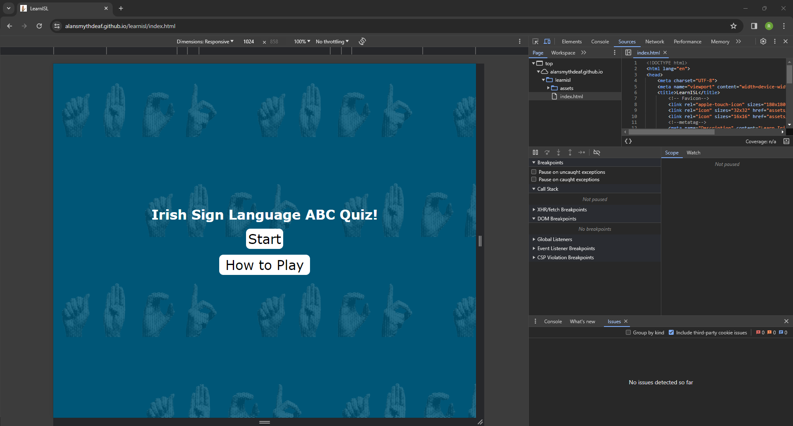
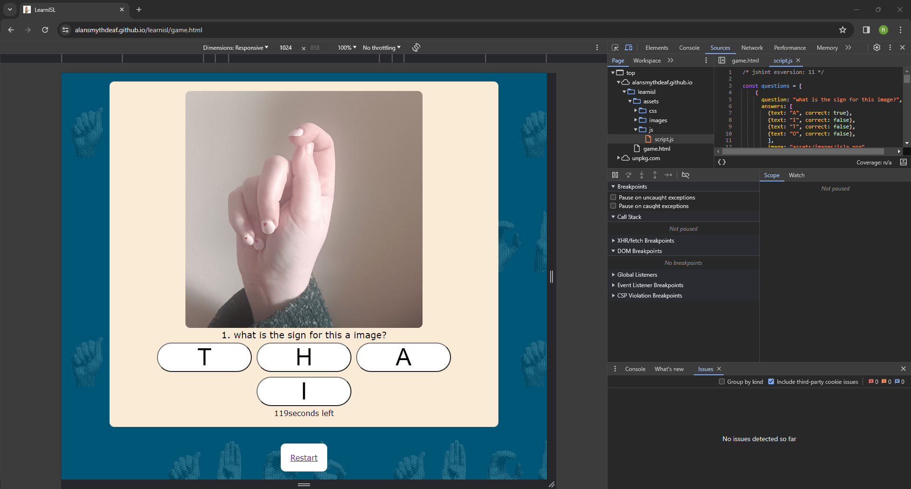
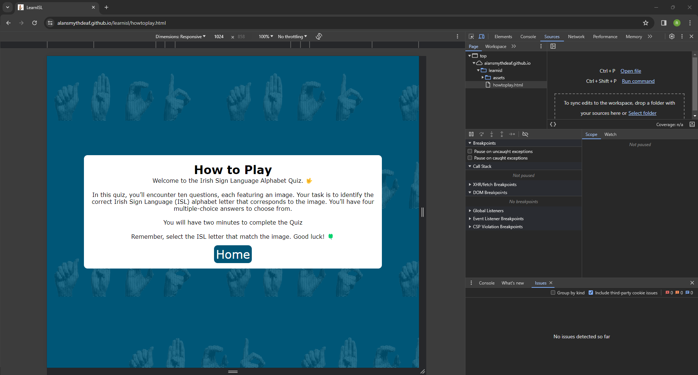

# Testing

Return back to the [README.md](README.md) file.

In this section, is the testing page, I believe I did my best that I have tested each pages.

## Code Validation

### HTML

I have used the recommended [HTML W3C Validator](https://validator.w3.org) to validate all of my HTML files.

| Page | W3C URL | Screenshot | Notes |
| --- | --- | --- | --- |
| Home | [W3C](https://validator.w3.org/nu/?doc=https%3A%2F%2FAlanSmythDeaf.github.io%2Flearnisl%2Findex.html) |  | Document checking completed. No errors or warnings to show. |
| Game | [W3C](https://validator.w3.org/nu/?doc=https%3A%2F%2Falansmythdeaf.github.io%2Flearnisl%2Fgame.html) |  | Document checking completed. No errors or warnings to show. |
| howtoplay | [W3C](https://validator.w3.org/nu/?doc=https%3A%2F%2Falansmythdeaf.github.io%2Flearnisl%2Fhowtoplay.html) |  | Document checking completed. No errors or warnings to show. |

### CSS

I have used the recommended [CSS Jigsaw Validator](https://jigsaw.w3.org/css-validator) to validate all of my CSS files.

| File | Jigsaw URL | Screenshot | Notes |
| --- | --- | --- | --- |
| style.css | [Jigsaw](https://jigsaw.w3.org/css-validator/validator?uri=https%3A%2F%2FAlanSmythDeaf.github.io%2Flearnisl) |  | No Errors |

### JavaScript
I have used the recommended [JShint Validator](https://jshint.com) to validate all of my JS files.

| File | Screenshot | Notes |
| --- | --- | --- |
| script.js |  | One warning 145 A leading decimal point can be confused with a dot: '.5'. - One undefined variable 185 swal & 191 swal. |

## Browser Compatibility

I've tested my deployed project on multiple browsers to check for compatibility issues.

| Browser | Home/index | Game | How to play | Notes |
| --- | --- | --- | --- | --- |
| Chrome |  |  |  | Works as expected |
| Firefox |  |  |  | Works as expected |
| Edge |  |  |  |  Works as expected |

## Responsiveness
I've tested my deployed project on multiple devices to check for responsiveness issues.

- Mobile Phone

| Index/Home | Game  | How to play |
| --- | --- | --- |
|  |  |  | 

- Tablet (Ipad Mini)

| Index/Home | Game  | How to play |
| --- | --- | --- |
|  |  |  | 

- Laptop / Desktop

| Index/Home | Game  | How to play |
| --- | --- | --- |
|  |  |  | 

## Lighthouse Audit

I've tested my deployed project using the Lighthouse Audit tool to check for any major issues.

- Desktop

| Page | Screenshot | Notes |
| --- | --- | --- |
| Home / Index |  | Serve images in nextgen formats - Serve static assets with an efficient cache policy - Links do not have descriptive text |
| Game|  | Serve images in nextgen formats - Serve static assets with an efficient cache policy - Image elements do not have explicit width and height|
| How to play |  | Serve images in nextgen formats - Serve static assets with an efficient cache policy |

- Mobile

| Page | Screenshot | Notes |
| --- | --- | --- |
| Home / Index |  | Serve images in nextgen formats - Serve static assets with an efficient cache policy |
| Game |  | Serve images in nextgen formats - Avoid large layout shifts - Largest Contentful Paint element - Image elements do not have explicit width and height - Serve static assets with an efficient cache policy |
| /how to playGallery |  | Serve images in nextgen formats - Serve static assets with an efficient cache policy |

## User Story Testing

| User Story | Screenshot |
| --- | --- |
| As a new site user, I would like to understand where to go, so that I can either play the quiz or learn how to play the game. |  |
| As a new site user, I would like to be able to play the quiz easily. |  |
| - As a returning site user, I would like to do the quiz easily over and over again and hopefully get 10 out of 10.. |  |

## Bugs

| Home / Index | Game | How to play |
| --- | --- | --- |
|  |  |  |

There were bugs throughout the project but unfortunely I didn't manager to screenshot any of the issue, As I can recall I had issue 

- With the images not changing through out the quiz, the issue was that in JS the questions part, the images area i.e. 'image: "assets/images/isla.png",' i forgot to put a comma in the rest of it.

- 'CurrentQuestion' was used before it was declared which is illegal for 'let' variables so I move the it above the 'questionImg.src'

## Unfixed Bugs

There are no remaining bugs that I am aware of.
